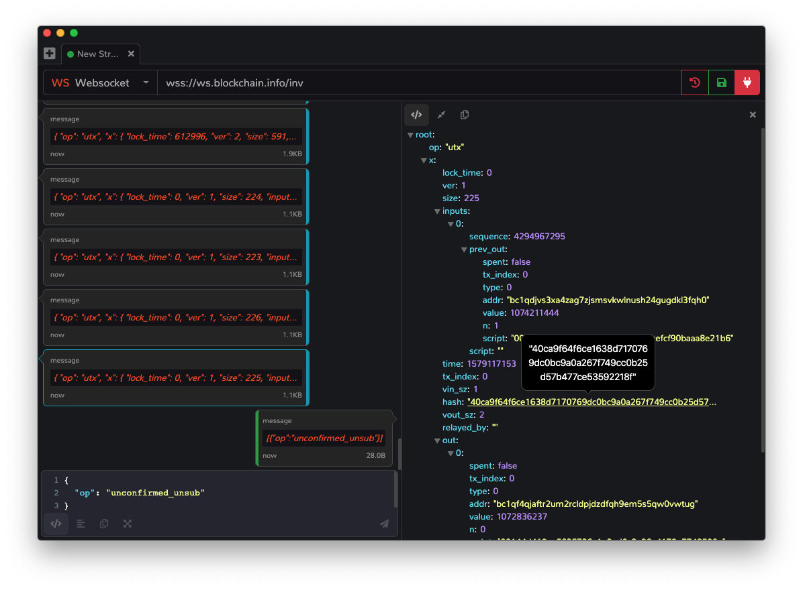

  

<h1 align="center">
  Kido
</h1>

  A cross-platform socket debugger.

  

# Development

Run `npm start` to compile and run the app locally.

# Built Using

- [Electron](https://electronjs.org) - Desktop Framework
- [PouchDB](https://pouchdb.com/) - Web Browser Data Storage
- [Angular](https://angular.io/) - Web Framework
- [NGRX](https://ngrx.io/) - Angular Redux Pattern State Management

# Supported Sockets

- [Websocket](https://rxjs-dev.firebaseapp.com/api/webSocket/webSocket)
- [Socket.IO](https://socket.io/)
- [SockJS](https://sockjs.org/)
- [SignalR](https://dotnet.microsoft.com/apps/aspnet/signalr)
